# Google Earth Engine

## Google Earth Engine for ecological modelling
The application of satellite derived datasets and geospatial analysis techniques in the fields of ecology and conservation has grown substantially over the last decade. With the emergence of cloud-based computing platforms that facilitate big data analysis, researchers, resource managers and remote sensing enthusiasts are now able to interrogate petabyte-scale datasets with ease.  

Google Earth Engine (GEE) is a cloud-based computing platform which uses JavaScript commands to access and analyse planetary-scale geospatial datasets drawn from a variety of platforms. Through an internet-accessible application programming interface (API) and associated web-based interactive development environment (IDE), Google Earth Engine users are able to mine a massive collection of geospatial data for change detection, resource qualification and trend mapping on the Earth's surface like never before. The capacity of GEE to analyse remotely sensed data holds enormous potential for conservation planning and resource management.  

This course aims to train students, researchers and practitioners in the application of Google Earth Engine in conservation science. Specifically, it seeks to familiarize participants with the basic operation of the GEE environment, focusing on visualization, analysis and automated detection of biological patterns and processes. 
The course will begin with a brief review of the fundamental theory behind remote sensing and geospatial analyses, followed by a series of tutorials.

- [Prac1: Getting started](gee_prac1.md)
- [Prac2: Spectral indices]
- [Prac3: Time series-NDVI]
- [Prac4: Interactive App]
- [Prac5: Species patterns]
- [Prac6: Landcover class]
- [Prac7: Time series-Fire]
- [Prac8: Change analysis]

## Practical 1: Getting started with Google Earth Engine
Basic JavaScript rules, create, import, explore and visualising datasets
by Sandra MacFadyen @ [https://www0.sun.ac.za/biomath/](https://www0.sun.ac.za/biomath)

Access the completed practical script [here](https://code.earthengine.google.com/76ed4ea4c97a064555880dcf09f93f5f)

### Learning Objectives
By the end of this practical you should be able to:
- Understand the basic layout of Google Earth Engine platform (incl. the Code Editor).
- Understand basic JavaScript syntax rules.
- Find and import datasets into the code editor.
- Inspect a dataset in the console.
- Visualize datasets in the interactive map explorer.
- Use simple functions.
- Know where to find help.

### Access your code editor
The first step is to access the GEE code editor. 
This can be done from the earth engine [home page](https://earthengine.google.com/) by going to platform –> Code Editor. 
Alternatively, you can access it directly from [https://code.earthengine.google.com/](https://code.earthengine.google.com)

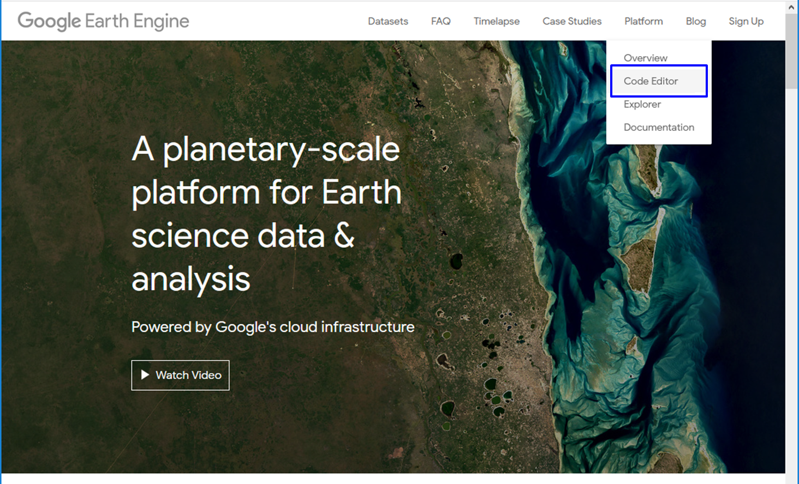
Take a look at the <a href=" https://developers.google.com/earth-engine/guides/playground">Google Earth Engine >> Guides >> Earth Engine Code Editor</a> section for a nice description of different panels and tabs.
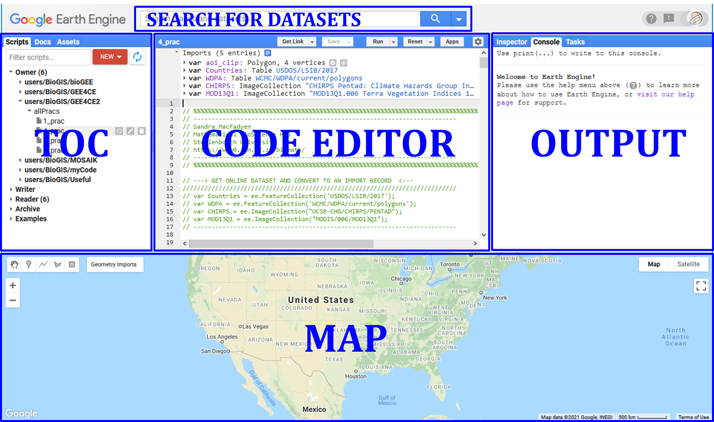

### Create your own repository, folders and files
From the Scripts panel click NEW >> Repository or >> Folder or >> File
Or if you already have a script open, click Save >> Save as..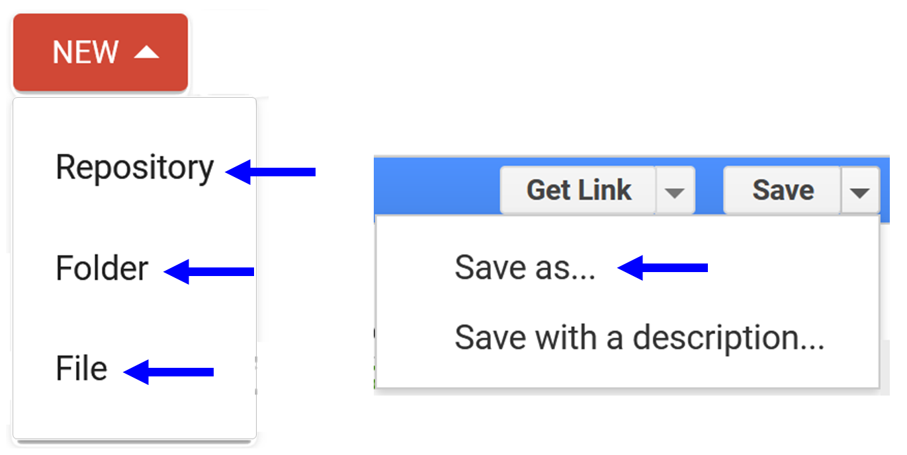

### Basic JavaScript syntax
Let's start off with a simple "Hello World" exercise:
```js
print('Welcome to the world of GEE!');
var myMessage = 'GEE world - Sandra was here :)'; // Variable or object
print(myMessage);
 ```
### Find and import datasets in the code editor
***Draw your own***
Create your first import variables using the geometry tools. 
For example, "Add a marker" or "Draw a rectangle". See the new 'geometry' variable added to the 'Imports' section? 
You can 'Edit layer properties' e.g. the name or colour from "Geometry Import" or assets.
It is important to 'Exit' the 'Point drawing' and '+ new layer' to avoid creating a 'GeometryCollection' instead of a 'Point' geometry.
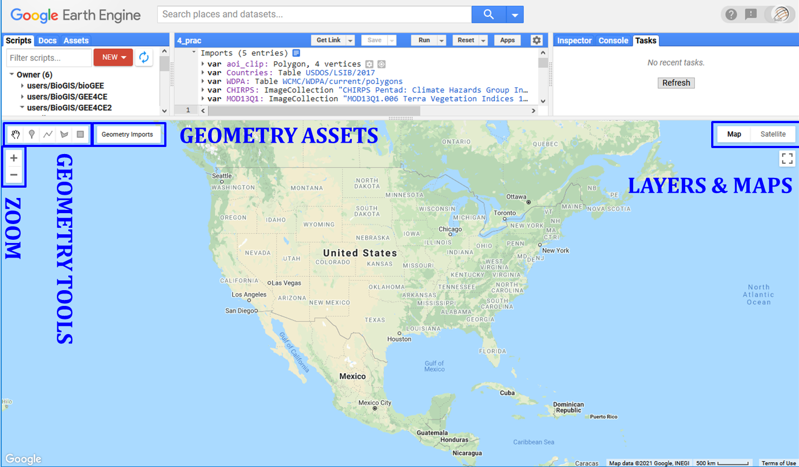

### Create variables from known coordinates
Or you can create your own variables using known coordinates. 

```js
var skukuza = ee.Geometry.Point([31.5912, -24.9947]);
var krugerAOI = ee.Geometry.Polygon([[[30.6821, -22.2315], [30.6821, -25.5061], 
                                      [32.1542, -25.5061], [32.1542, -22.2315]]]);</code><button class="btn" id="copy-button" data-clipboard-target="#target2">Copy</button>
```
### Visualise geometries
To display these new variables on the map area below, you need to use the ```Map.``` commands.
First zoom to a location on the map and then add the new variable as a layer with user defined display/legend properties.

```js
// First center and zoom to a location on the map
// There are different ways to center your map
Map.setCenter(31.54, -23.96, 7); // Use the "Inspector" to click and get coords
Map.centerObject(krugerAOI, 7); // Or using your geometry variable

// Then add the variable to the map and change the colours
Map.addLayer(krugerAOI, {color: 'green'}, 'Kruger Park');
Map.addLayer(skukuza, {color: 'red'}, 'Skukuza Camp');</
```
### Find and import online GEE datasets
To find GEE datasets, use the “Search places and datasets” panel visible in the Code Editor or 
browse datasets by satellite platform or keyword tags from the [Earth Engine Catalog](https://developers.google.com/earth-engine/datasets) page.

### Images
To import images from GEE you will use ```ee.Image()```. There are two ways you can do this. 
The easiest is to use the search function and then click Import to add the dataset to your Imports section.
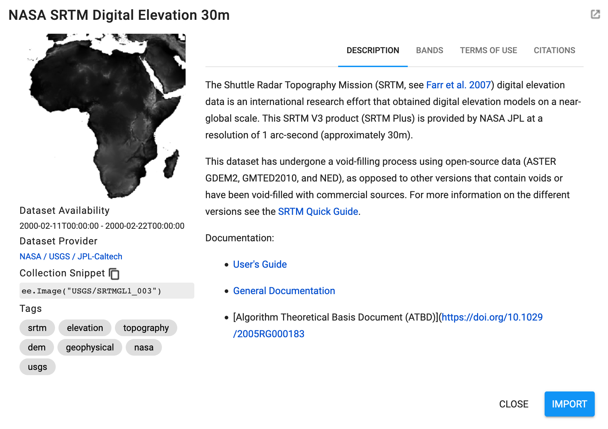

The second is to copy the Collection Snippet code and paste it into your script. Don't forget to make a new variable to hold the dataset.

```js
var elevation = ee.Image('USGS/SRTMGL1_003');
print('Elevation variable info', elevation); // Print is your friend
print('Elevation data type', elevation.name()); // Prints data type
```

Once you've done that, if you hold your mouse over your new variable/code, you'll see a yellow message pop-up asking if you want to convert it to an import record. If you click Convert, the variable will be moved to the Imports section automatically.
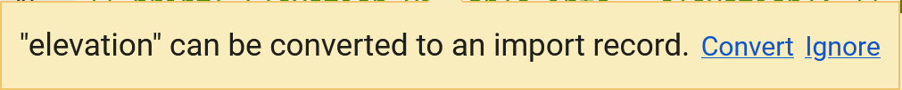

### Visualise images
To display images in your map you zoom to a location of interest and add then add the image as a layer but with more detailed display/legend properties.
You can do this using the "Visualization Parameters" GUI or code it directly(see code box below).
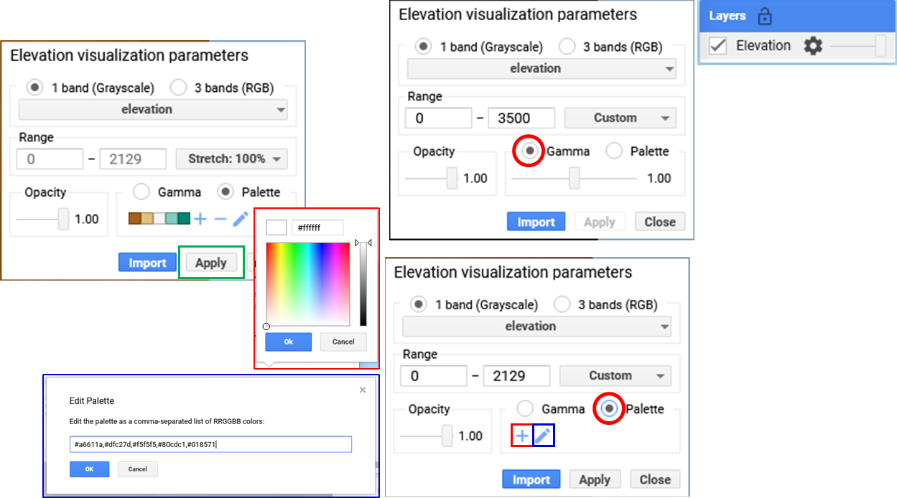

```js
// Center your map to specific area and zoom level
Map.setCenter(31.54, -23.96, 7);
// Play with the legend parameters
Map.addLayer(elevation, {min: 0, max: 3500}, 'Elevation'); // Try without specific colours
Map.addLayer(elevation, {min: 0, max: 3500, palette: ['blue','yellow','red']}, 'Elevation'); // Now add colour range
// !NB! It matters what order you add variables to the map

// What if we need a palette to display the variable better?
var eleVis = {
  min: 0,
  max: 1000,
  palette: [
    '141414', '383838', '808080', 'EBEB8F', 'F7D311', 'AA0000', 'D89382',
    'DDC9C9', 'DCCDCE', '1C6330', '68AA63', 'B5C98E', 'E1F0E5', 'a975ba',
    '6f198c'
  ],
};
// Here are some guides to help you find colours
// e.g. #DAF7A6,#FFC300,#FF5733,#C70039,#900C3F,#581845 
// https://colorbrewer2.org/#type=sequential&scheme=BuGn&n=3
// https://github.com/gee-community/ee-palettes

Map.setCenter(31.54, -23.96, 7);
Map.addLayer(elevation, eleVis, 'Elevation with eleVis'); // See how different your two layers look?
```
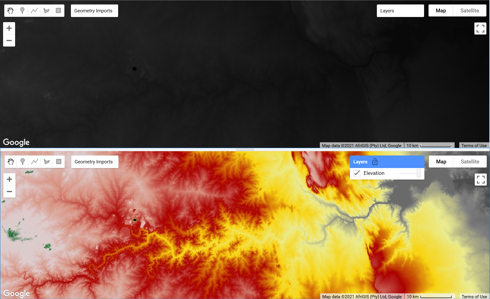

Use the 'Inspector' to get "Point", "Pixel" and "Object" information.


### Images with multiple bands
WorldClim BIO Variables V1
Most of you will probably be familiar with WoldClim's [Bioclimatic Variables](https://www.worldclim.org/data/bioclim.html).
There are 19 different variables coded bio01 to bio19 e.g. bio01 = Annual mean | bio02 = Mean diurnal | bio03 = Isothermality (bio02/bio07) | bio04 = Temperature seasonality etc.
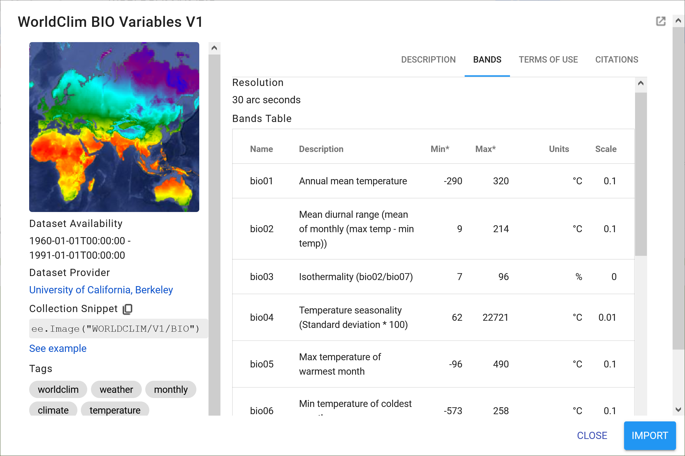

To use one of these variables you need to select the appropriate band. For example "Annual Mean Temperature".

```js
// Import WorldClim BIO Variables V1
var bio = ee.Image('WORLDCLIM/V1/BIO');
var amt = bio.select('bio01');

// Same thing, less code
// var amt = ee.Image('WORLDCLIM/V1/BIO').select('bio01'); 

// Your display/legend properties
var amtVis = {
  min: -230.0,
  max: 300.0,
  palette: ['blue', 'purple', 'cyan', 'green', 'yellow', 'red'],
};

// Display the results on your map below
Map.setCenter(31.54, -23.96, 2);
Map.centerObject(krugerAOI, 7);
Map.addLayer(amt, amtVis, 'Annual Mean Temperature');
Map.addLayer(krugerAOI, {color: 'green'}, 'Kruger Park');
// !NB! Remember it matters what order you add variables to the map
```

### Feature collections
Feature collections work in a similar way to image collections, although the display parameters and filtering conditions are slightly different.
For example, let's display International Boundaries as polygons (i.e. vectors)


```js
// Import the simplified International Boundary Polygons (LSIB 2017) 
var countries = ee.FeatureCollection("USDOS/LSIB_SIMPLE/2017");

// Your display properties
var cntVis = {
    fillColor: 'b5ffb4',
    color: '00909F',
    width: 3.0,
};

// Add results to map
Map.setCenter(23.63, 5.68, 2);
Map.addLayer(countries, cntVis, 'World Borders');
```

### Filtering feature collections
Now to filter the features we need to know what column/field our contains the information we would like to filter for. In this case it's a "string" field named "country_na" as indicated in the "TABLE SCHEMA" in the figure above.

```js
// Country boundaries filtered to Costa Rica
var costaRica = countries.filter(ee.Filter.eq('country_na', 'Costa Rica'));
print('eq Costa Rica', costaRica); // Remember, this returns info about our feature

// Add results to map
Map.centerObject(costaRica, 7);
Map.addLayer(costaRica,{}, 'Costa Rica');

// Country boundaries filtered to Costa Rica  and Colombia or a "list" of values
var costaColo = countries.filter(ee.Filter.inList('country_na',['Costa Rica','Colombia']));
print('costaColo data type',costaColo.name()); // Returns ComputedObject type
print('inList costaColo', costaColo); // Returns info about feature
Map.centerObject(costaColo, 4);
Map.addLayer(costaColo,{}, 'Costa Rica and Colombia');
```

Here is another example using polygons depicting the World Database on Protected Areas (WDPA)


```js
// Import the WDPA polygons
var WDPA = ee.FeatureCollection('WCMC/WDPA/current/polygons');
// WDPA boundaries filtered to 'Kruger' National Park' in South Africa
var kruger = WDPA.filter(ee.Filter.eq('ORIG_NAME', 'Kruger National Park'));
// print('Kruger Info',kruger);

// Add results to map
Map.centerObject(kruger, 7);
Map.addLayer(kruger,{fillColor:'ceea89',color:'789630',width:0.5}, 'Kruger National Park');
```

### Image collections filtered by dates and bands
In many cases you will be dealing with image collections with a series of bands over a period of time. To filter for the date range you're interested in you will use the ee.Filter.date command. Let's test this using the 500m monthly burned area product from MODIS.


```js
// Import the MODIS Burned Area Monthly Global 500m
var modis64 = ee.ImageCollection('MODIS/006/MCD64A1');
var modisBurn = modis64.select('BurnDate');
var burnArea = modisBurn.filter(ee.Filter.date('2018-01-01', '2018-12-31'));
print('burnArea Info long', burnArea);

// Visual parameters for legend
var burnVis = {
  min: 30.0,
  max: 341.0,
  palette: ['4e0400', '951003', 'c61503', 'ff1901'],
};

// Add results to map
Map.centerObject(krugerAOI, 7);
Map.addLayer(burnArea, burnVis, 'Areas Burnt Oct 2018');
```

### Simple functions and single images
There are many built-in functions you can use to process and analyse the different GEE data products. We will be going through a number of these in our different practical sessions but for now let's look at some simple ones to get you started. The most common is probably the .clip function, which we'll test on our elevation data from earlier.

```js
// Clip the elevation data to your area of interest
var eleClip = elevation.clip(costaRica);

// Add results to map
Map.centerObject(costaRica, 7);
Map.addLayer(eleClip, {min: 0, max: 350, palette: ['blue','yellow','red']}, 
                      'Costa Rica Elevation');
```

Let's try generating a slope from this new elevation variable using the built-in ee.Terrain.slope function.

```js
// Generate a slope from the clipped SRTM elevation model
var slope = ee.Terrain.slope(eleClip);

// Add results to map
Map.centerObject(costaRica, 7);
Map.addLayer(slope, {min: 0, max: 8}, 'Slope', false);
// Display properties do not work for this area

// Change the legend parameters 
var slopeVis = {
  min: 0,
  max: 8,
  palette: [
    '#f7fcb9','#addd8e','#31a354','000000'
  ],
};

// Add new results to map
Map.addLayer(slope, slopeVis, 'Slope with palette');
```


### Simple functions and image collections
Applying functions to image collections starts to get a little trickier. For example, let's try summarise some Sentinel-2 imagery (Sentinel-2 MSI: MultiSpectral Instrument, Level-1C)and change our display properties at the same time.


```js
// Import Sentinel-2 imagery
// Filter the image collection based on several properties
var copCol = ee.ImageCollection("COPERNICUS/S2")
               .filter(ee.Filter.date('2018-01-01','2019-12-31')) // Filter date range
               .filterBounds(krugerAOI); // Filter area
print('copCol Info', copCol);

// Calculates a median value for all pixels over this time period                            
var cop2Med =  copCol.median();
// Or you could use *.sort("CLOUD_COVERAGE_ASSESSMENT")*
// And them select the first image of the collection 
// i.e. the most cloud free, using *.first()* instead of .median()

// Check output
print('Sentinel 2 image Info', cop2Med);

// Add new results to map
Map.setCenter(31.5975, -24.9945, 12);
// Select Bands 4, 3 and 2 = red, green and blue bands to make a true-colour composite
// Add this RGB composite to map, without defined parameters
Map.addLayer(cop2Med, {bands:['B4','B3','B2']}, 'No defined vis parameters');
// Results are rubbish
```
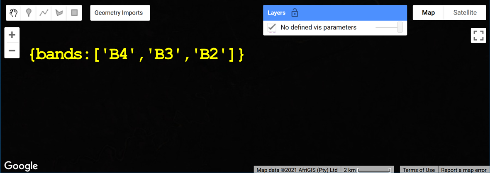

```js
// Add the S2 value range from 0 to 3000, and try again
Map.addLayer(cop2Med, {bands:['B4','B3','B2'], min:0, max: 3000}, 'True-colour');
// You can also change the order of bands e.g. B8,B4,B3 = false-colour composite etc
Map.addLayer(cop2Med, {bands:['B8','B4','B3'], min:0, max: 3000}, 'False-colour');
// Here using the NIR band, this false-colour shows photosynthetically 
// active vegetation in bright red
```


### Sharing your code to complete the practical assignments
To complete the practical exercise below you need to know how to share your scripts with us. Simply click on "Get Link" - the actual button NOT the dropdown arrow - Then click the "Click to copy link" button and paste that in an email. !NB! Please remember to add the prac number in the header.
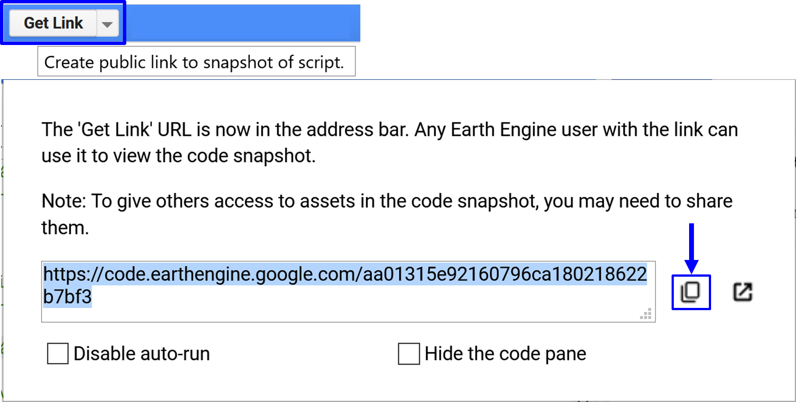