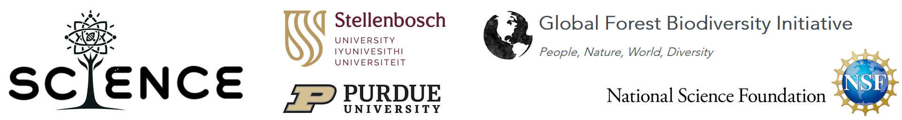
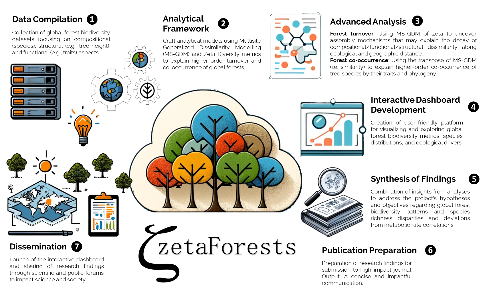

# Science-i

[Science-i: Bridging Worlds Competition 2024](https://science-i.org/bridging-worlds-2024/){:target="_blank"}
Our proposal below aligns with the competition's focus on innovative, impactful research in forest science, leveraging advanced computational resources and global biodiversity databases to address critical ecological challenges.

## ZetaForests: Unveiling higher-order turnover and co-occurrence of global forests
Our project, ZetaForests, aims to elucidate the complex interplay of compositional, structural, and functional turnover of biodiversity between local communities across global forests, leveraging Multisite Generalized Dissimilarity Modelling (MS-GDM) of Zeta Diversity (Fig. 1). Zeta diversity offers a set of metrics for complete biodiversity partitioning, unlike the concept of Alpha and pairwise Beta metrics. This novel approach will address why African tropical forests exhibit lower species richness compared to their counterparts in Asia and the Amazon, and why traditional metabolic rate theories fail to explain species richness in lower latitude tropics. By integrating extensive biodiversity datasets and employing advanced computational analyses, this project aims to uncover the underlying mechanisms of forest biodiversity maintenance and explain the decay of biodiversity similarity of regional species along a prevalence continuum (from rare - low prevalence, to widespread - high prevalence). The project hypothesizes that unique historical, ecological, and climatic factors in African tropical forests contribute to these anomalies, compounded by significant data gaps.

## Project impact incl. current and future use in science and society
ZetaForests aims to redefine ecological research and conservation strategies by providing novel insights into forest biodiversity. This advancement will enable the creation of improved ecosystem management strategies, boosting forest resilience and sustainability, such as the development of crucial metrics for invasibility and openness. The project's methodologies and findings could serve as a blueprint for similar studies in other biomes, fostering a more comprehensive understanding of global biodiversity and guiding policy decisions for biodiversity conservation.

## Knowledge gap explained
Despite extensive research, the comprehensive understanding of global forest biodiversity patterns remains elusive, particularly the intricate species interactions and the full spectrum of biodiversity (compositional, structural, and functional). The project aims to fill these gaps by leveraging underutilized MS-GDM and Zeta Diversity metrics to provide a more nuanced understanding of forest biodiversity, particularly addressing the anomalies observed in African tropical forests. More specifically, we will focus on 1) **Forest turnover**: Using MS-GDM (i.e. dissimilarity) of zeta to uncover assembly mechanisms that may explain the decay of compositional/functional/structural dissimilarity along ecological and geographic distance, for different zeta orders; and 2) **Forest co-occurrence**: Using the transpose of MS-GDM (i.e. similarity) to explain higher-order co-occurrence of tree species by their traits and phylogeny, potentially identifying species guilds and interactions using this unique global dataset of local forest community surveys.

## Project timeline
- **Months 1-6**: Development of analytical frameworks and data compilation.
- **Months 7-12**: Application of MS-GDM and zeta diversity - analyses; initial dashboard development.
- **Months 13-18**: In-depth biodiversity pattern analysis; - dashboard refinement.
- **Months 19-24**: Synthesis of findings; publication in Nature; -release of the interactive dashboard.