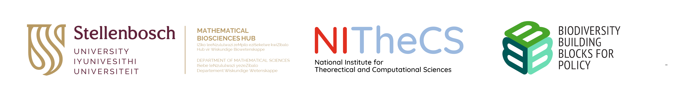

# About

# 
## Mathematical Biosciences Lab
Our lab is a multidisciplinary research team at the interface of mathematics and biology/life sciences. As part of the Department of Mathematical Sciences at Stellenbosch University in South Africa, we are a dynamic research group led by Prof Cang Hui, a SARChI Chair in Mathematical and Theoretical Physical Biosciences. Our interests lie in proposing models and theories for explaining emerging patterns in ecology. Ecology studies biodiversity in its variety and complexity. As ecological processes are highly complex and adaptive, we rely on the simplicity of mathematical language to build models and theoretical frameworks.

## BioMath Tutorials
Welcome to the tutorials section! Here you’ll find a range of resources to help you get started with various tools and techniques.

- [Spatial R](spatial_r.md): Learn about spatial analysis in R.
- [Species Distribution Modelling](sdm.md): Techniques and tools for species distribution modeling.
- [Google Earth Engine](gee.md): An introduction to remote sensing and analysis with Google Earth Engine.
- [Other Resources](resources.md): Additional materials and resources.
